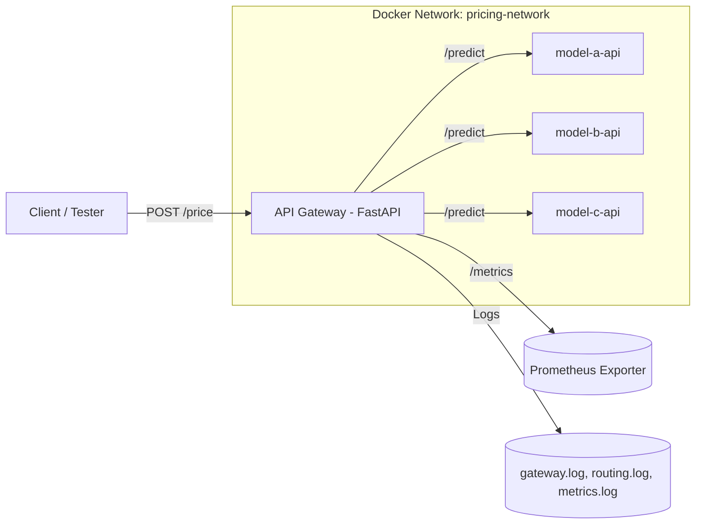

# Ominimo Pricing Engine — API Gateway
A modular FastAPI-based gateway for car insurance pricing models, supporting
feature-based routing, A/B testing, and observability with Prometheus metrics.

---

Quick Start
```
# Build and start all services
docker compose up --build

# Run basic smoke test
bash tests/smoke.sh

# Run the full automated test suite
poetry run pytest -q tests/test_gateway.py tests/test_sample_payloads.py
```

Access the gateway:

- API UI: http://localhost:8000/docs
- Metrics: http://localhost:8000/metrics
- Health check: http://localhost:8000/health

---
## Architecture Overview



Core components

- `gateway/` — main FastAPI service with routing, logging, observability.
- `endpoints/` — model microservices (A/B/C/D).
- `tests/` — automated & demo test suites.
- `docs/` — detailed documentation, diagrams, and architecture.

---
## Key Features

Feature-based routing
- Rules such as birthdate_even_odd and postal_code_region.

Sticky A/B testing
- Deterministic hashing on unit_field (e.g., postal code).
- Configurable distribution in models.yaml.

Dynamic model registration
- Edit gateway/config/models.yaml and reload via POST /config/reload.

Observability & metrics
- Structured logs per gateway component.
- Prometheus /metrics endpoint.
- SRM (sample ratio mismatch) checks for A/B fairness.

Automated testing
- Full pytest suite for routing, metrics, and configuration validation.

---
## Configuration
`gateway/config/models.yaml`

Defines models, routing rules, and A/B testing weights.
```
models:
    model-a:
        url: "http://model-a-api:8001"
        version: "v0.1.0"
        enabled: true

routing_rules:
    default: "ab_testing_percentage"
    available_rules: ["birthdate_even_odd", "postal_code_region", "ab_testing_percentage"]

ab_testing:
    enabled: true
    experiment_id: "api_routing_2025_10"
    unit_field: "postal_code"
    distributions:
        model-a: 0.33
        model-b: 0.33
        model-c: 0.34
```

Reload without restart:
```
curl -X POST http://localhost:8000/config/reload
```

---
## Documentation Index

| Topic                          | File                                                 |
|--------------------------------|------------------------------------------------------|
| **System Architecture & Flow** | [docs/architecture.md](docs/architecture.md)         |
| **Adding a New Model**         | [docs/adding-new-model.md](docs/adding-new-model.md) |
| **Testing Routing & A/B**      | [docs/testing-routing.md](docs/testing-routing.md)   |
| **Observability & Metrics**    | [docs/observability.md](docs/observability.md)       |

---
## Developer Utilities

| Script                          | Purpose                                  |
|---------------------------------|------------------------------------------|
| `tests/smoke.sh`                | Quick system check (health/config/price) |
| `tests/test_gateway.py`         | CLI-friendly end-to-end demo             |
| `tests/test_sample_payloads.py` | Feature + A/B routing tests              |
| `tests/sample_payloads.json`    | Input data for functional tests          |

---
## Example Outputs
Prometheus metrics sample
```
gateway_model_requests_total{model="model-a"} 120
gateway_model_latency_seconds_sum{model="model-b"} 8.94
gateway_exposures_total{experiment="api_routing_2025_10",model="model-c"} 98
```

SRM logs sample
```
SRM exp=api_routing_2025_10 total=300
counts={'model-a':99,'model-b':102,'model-c':99}
expected={'model-a':0.33,'model-b':0.33,'model-c':0.34}
chi2=0.04 df=2 suspicious=False
```

---
## Folder Structure
```
.
├── docker-compose.yml
├── gateway/
│   ├── app/
│   │   ├── main.py
│   │   ├── routing.py
│   │   ├── observability.py
│   │   ├── models.py
│   │   └── config.py
│   ├── config/
│   │   └── models.yaml
│   └── logs/
├── endpoints/
│   ├── model_a_endpoint/
│   ├── model_b_endpoint/
│   └── model_c_endpoint/
├── tests/
│   ├── sample_payloads.json
│   ├── test_gateway.py
│   ├── test_sample_payloads.py
│   ├── demo_suite.py
│   └── smoke.sh
└── docs/
    ├── architecture.md
    ├── adding-new-model.md
    ├── testing-routing.md
    ├── observability.md
    └── troubleshooting.md
```

## License
MIT License © 2025 Mladen Nikolić