# Adding a New Model Service (Version or Variant)


This guide explains how to add a new pricing model service (for example, model-d-api) to the Ominimo Pricing Engine architecture and integrate it seamlessly with the API Gateway.

---
## 1. Overview

Each pricing engine model (A, B, C, etc.) is a standalone project, located on any other repo, wrapped in FastAPI microservice, packaged with Poetry and deployed via Docker Compose.
The API Gateway routes traffic to these models based on configured rules (feature-based or A/B testing).

When adding a new model:

- Create a new service directory (e.g., /endpoints/model_d_endpoint/)

- Register the service in docker-compose.yml

- Add the model to gateway/config/models.yaml

- Reload configuration using /config/reload — no gateway restart required

## 2. Create the endpoint service

Inside endpoints/, duplicate one of the existing model folders (e.g., model_a_endpoint)
and rename it to model_d_endpoint.

```mermaid
---
config:
  layout: elk
---
flowchart LR
    A["endpoints/"] --> A1["model_a_endpoint/"] & A2["model_b_endpoint/"] & A3["model_c_endpoint/"] & A4["model_d_endpoint/ 🆕"]
    A1 --> A11["main.py"] & A12["pyproject.toml"] & A13["Dockerfile"]
    A2 --> A21["main.py"] & A22["pyproject.toml"] & A23["Dockerfile"]
    A3 --> A31["main.py"] & A32["pyproject.toml"] & A33["Dockerfile"]
    A4 --> A41["main.py 🆕"] & A42["pyproject.toml 🆕"] & A43["Dockerfile 🆕"]
    style A fill:#f7fafc,stroke:#2b6cb0,stroke-width:2px
    style A4 fill:#c6f6d5,stroke:#2f855a,stroke-width:2px
```



---
### main.py

Use the same structure as Model A but replace names, ports, and logging details:

```python

import logging
import os
from datetime import date
from typing import Any, Dict

from fastapi import FastAPI
from pydantic import BaseModel, Field

try:
    from model_d import ModelD
    model = ModelD()
except ImportError as e:
    raise ImportError(f"Model package not available: {e}")

app = FastAPI(
    title="Model D API",
    version="0.1.0",
    description="New pricing logic",
)

logging.basicConfig(
    level=os.getenv("LOG_LEVEL", "INFO"),
    format="%(asctime)s - %(name)s - %(levelname)s - %(message)s",
    handlers=[logging.FileHandler("./logs/model-d.log"), logging.StreamHandler()],
)
logger = logging.getLogger(__name__)

class PriceRequest(BaseModel):
    birthdate: date = Field(..., description="Driver birth date")
    driver_license_date: date = Field(..., description="License issue date")
    car_model: str
    car_brand: str
    postal_code: str

@app.post("/predict")
async def predict(request: PriceRequest):
    result = model.calculate_price(
        birthdate=request.birthdate,
        driver_license_date=request.driver_license_date,
        car_model=request.car_model,
        car_brand=request.car_brand,
        postal_code=request.postal_code,
    )
    logger.info(f"Prediction generated: {result['price']} EUR")
    return result

@app.get("/health")
async def health():
    return {"status": "healthy", "model": model.name, "version": "0.1.0"}

@app.get("/")
async def root() -> Dict[str, Any]:
    """
    Root endpoint with service information.

    Returns:
        Service metadata and available endpoints
    """

    return {
        "service": "Model D API",
        "description": "<New Logic>-based car insurance pricing model",
        "version": "0.1.0",
        "model_available": model.name,
        "endpoints": {
            "predict": "POST /predict",
            "health": "GET /health",
            "docs": "GET /docs",
        },
    }
```

---
### pyproject.toml

Each endpoint uses Poetry for dependency management.
```
[tool.poetry]
name = "model-d-api"
version = "0.1.0"
description = "FastAPI microservice for Model D"
authors = ["Your Name <you@example.com>"]
package-mode = false

[tool.poetry.dependencies]
python = "^3.11"
fastapi = "0.104.1"
uvicorn = {version = "0.24.0", extras = ["standard"]}
pydantic = "2.7.0"
insurance-model-d = { git = "ssh://git@github.com/Mladja99/mock_models.git", subdirectory = "models/model_d", tag = "v0.1.0" }

[tool.poetry.group.dev.dependencies]
pytest = "^8.0.0"

[tool.poetry.scripts]
app = "main:app"
```

---
### Dockerfile

Use the same Docker build pattern as model_a_endpoint (you already have this structure):

```
FROM python:3.11-slim AS base
ENV POETRY_HOME="/opt/poetry" \
    POETRY_VERSION="1.8.3" \
    PIP_DISABLE_PIP_VERSION_CHECK=on \
    PYTHONDONTWRITEBYTECODE=1 \
    PYTHONUNBUFFERED=1 \
    POETRY_VIRTUALENVS_IN_PROJECT=true

# System deps (git, ssh, curl for healthcheck)
RUN apt-get update && \
    apt-get install -y --no-install-recommends git openssh-client curl && \
    rm -rf /var/lib/apt/lists/*

RUN mkdir -p -m 0755 /etc/ssh && \
    ssh-keyscan -t rsa,ecdsa,ed25519 github.com >> /etc/ssh/ssh_known_hosts

# Install Poetry
RUN curl -sSL https://install.python-poetry.org | python3 - --version ${POETRY_VERSION} && \
    ln -s ${POETRY_HOME}/bin/poetry /usr/local/bin/poetry

WORKDIR /app
COPY pyproject.toml ./
RUN --mount=type=ssh poetry install --no-interaction --no-ansi --only main
COPY main.py ./main.py
RUN mkdir -p /app/logs

EXPOSE 8004
HEALTHCHECK --interval=30s --timeout=10s --start-period=20s --retries=3 \
  CMD curl -f http://localhost:8004/health || exit 1

ENV PATH="/app/.venv/bin:${PATH}"
CMD ["uvicorn", "main:app", "--host", "0.0.0.0", "--port", "8004"]
```

---
## 3. Add it to docker-compose.yml

Append this under services::

```
model-c-api:
    build:
        context: ./endpoints/model_d_endpoint
        ssh:
            - default
        args:
            UID: ${UID}
            GID: ${GID}
    expose:
        - "8004"
    environment:
        - MODEL_NAME=model_c
        - LOG_LEVEL=INFO
        - UMASK=002
    healthcheck: # ensure it's really up
        test: [ "CMD", "curl", "-f", "http://localhost:8004/health" ]
        interval: 30s
        timeout: 10s
        start_period: 20s
        retries: 3
    volumes:
        - model_d_logs:/app/logs
    networks:
        - pricing-network
    restart: unless-stopped
```

Also add the log volume:
```
volumes:
  model_a_logs:
  model_b_logs:
  model_c_logs:
  model_d_logs: <- Add new one.
```

---
## 4. Register in gateway/config/models.yaml

- Add the new model entry:
```
models:
    model-d:
        name: "Model D - New Logic"
        version: "v0.1.0"
        url: "http://model-d-api:8004"
        enabled: true
        description: "<New type> pricing model"
```
- Update A/B distribution if needed
```
ab_testing:
    enabled: true
    distributions:
        model-a: 0.25
        model-b: 0.25
        model-c: 0.25
        model-d: 0.25
```

## 5. Build and deploy
docker-compose build model-d-api
docker-compose up -d model-d-api

---
## Validate the health endpoint:

curl -s http://localhost:8000/health | jq .

---
## 6. Reload configuration

No need to restart the gateway — just reload configuration:

curl -s -X POST http://localhost:8000/config/reload | jq .


### Confirm your new model is active:

curl -s http://localhost:8000/config | jq '.models.model-d'

---
## 7. Test the new model
A/B routing validation

Send a few hundred requests with varying postal codes and check distribution:

```shell
for i in {1..100}; do
  pc=$((10000 + RANDOM % 90000))
  curl -s -X POST http://localhost:8000/price \
    -H "Content-Type: application/json" \
    -d "{\"birthdate\":\"1990-06-15\",\"driver_license_date\":\"2010-08-20\",\"car_model\":\"Golf\",\"car_brand\":\"Volkswagen\",\"postal_code\":\"$pc\"}" \
  | jq -r '.gateway_metadata.model_id'
done | sort | uniq -c
```

### Health & metrics check
curl -s http://localhost:8000/metrics | grep 'model="model-d"'

---
## 8. Observability

Once the new model is active, the gateway automatically begins logging and tracking:
```
gateway_model_requests_total{model="model-d"}

gateway_model_latency_seconds_bucket{model="model-d"}

gateway_exposures_total{experiment="...", model="model-d"}
```
Logs:
```
gateway/logs/gateway.log
gateway/logs/routing.log
gateway/logs/metrics.log
```

---
## 9. Disable or remove a model

To temporarily disable in gateway/config/model.yaml:
```
models:
    model-d:
        enabled: false
```

### Reload:

curl -X POST http://localhost:8000/config/reload


### To remove completely:

- Delete the section from models.yaml
- Remove the service from docker-compose.yml
- Optionally delete the endpoint folder

---
## Summary
Actions:
-   Create a new FastAPI endpoint folder
-	Add `Dockerfile` and `pyproject.toml`
-	Add service to `docker-compose.yml`
-	Register it in `gateway/config/models.yaml`
-	`docker compose up -d`
-	`POST /config/reload`
-	Test and monitor via /metrics and logs