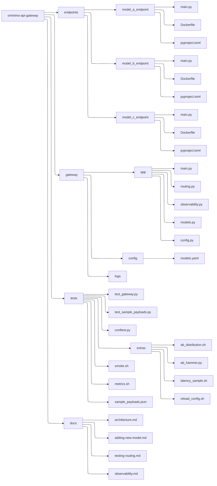
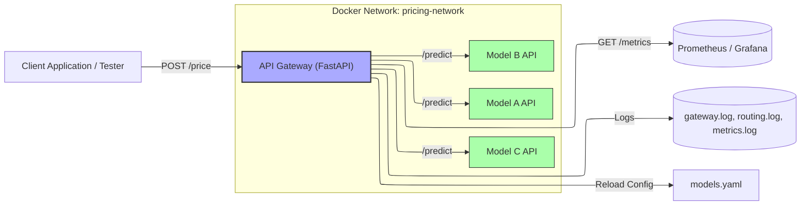
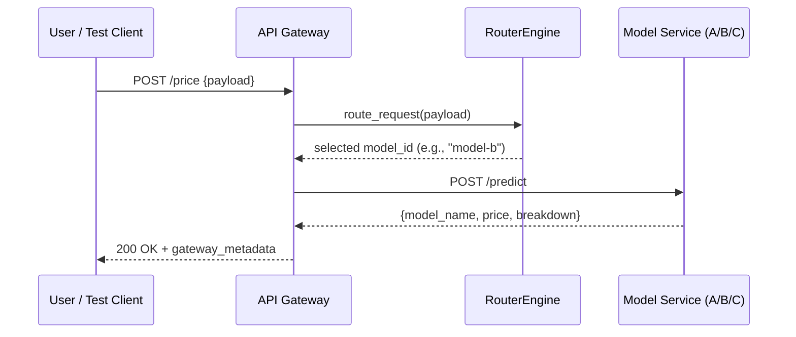
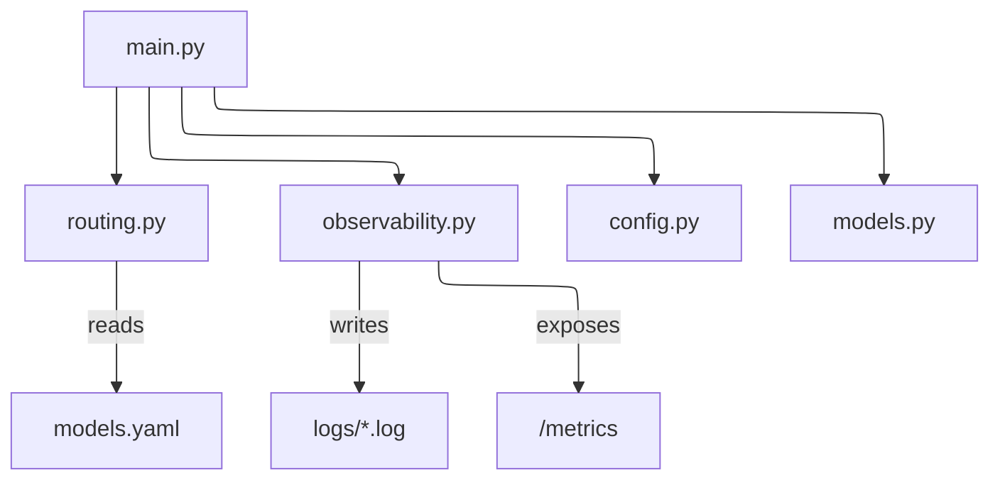

# Architecture

---
## Repository structure overview

```mermaid
---
config:
  layout: elk
---
flowchart LR
    A["ominimo-api-gateway"] --> B["endpoints"] & C["gateway"] & D["tests"] & E["docs"]
    B --> B1["model_a_endpoint"] & B2["model_b_endpoint"] & B3["model_c_endpoint"]
    B1 --> B11["main.py"] & B12["Dockerfile"] & B13["pyproject.toml"]
    B2 --> B21["main.py"] & B22["Dockerfile"] & B23["pyproject.toml"]
    B3 --> B31["main.py"] & B32["Dockerfile"] & B33["pyproject.toml"]
    C --> C1["app"] & C2["config"] & C3["logs"]
    C1 --> C11["main.py"] & C12["routing.py"] & C13["observability.py"] & C14["models.py"] & C15["config.py"]
    C2 --> C21["models.yaml"]
    D --> D1["test_gateway.py"] & D2["test_sample_payloads.py"] & D3["conftest.py"] & D4["extras"] & D5["smoke.sh"] & D6["metrics.sh"] & D7["sample_payloads.json"]
    D4 --> D41["ab_distribution.sh"] & D42["ab_hammer.py"] & D43["latency_sample.sh"] & D44["reload_config.sh"]
    E --> E1["architecture.md"] & E2["adding-new-model.md"] & E3["testing-routing.md"] & E4["observability.md"]
```

---
## System architecture

```mermaid
---
config:
    layout: elk
---
flowchart LR
    subgraph Docker_Network["Docker Network: pricing-network"]
        ModelA["Model A API"]
        Gateway["API Gateway (FastAPI)"]
        ModelB["Model B API"]
        ModelC["Model C API"]
    end
    Client["Client Application / Tester"] -- POST /price --> Gateway
    Gateway -- /predict --> ModelA & ModelB & ModelC
    Gateway -- GET /metrics --> Prometheus[("Prometheus / Grafana")]
    Gateway -- Logs --> LogFiles[("gateway.log, routing.log, metrics.log")]
    Gateway -- Reload Config --> ConfigFile["models.yaml"]
    style Gateway fill:#aaf,stroke:#333,stroke-width:2px
    style ModelA fill:#afa,stroke:#333,stroke-width:1px
    style ModelB fill:#afa,stroke:#333,stroke-width:1px
    style ModelC fill:#afa,stroke:#333,stroke-width:1px

```

---
## Request lifecycle (sequence diagram)

```mermaid
sequenceDiagram
    participant U as User / Test Client
    participant G as API Gateway
    participant R as RouterEngine
    participant M as Model Service (A/B/C)
    
    U->>G: POST /price {payload}
    G->>R: route_request(payload)
    R-->>G: selected model_id (e.g., "model-b")
    G->>M: POST /predict
    M-->>G: {model_name, price, breakdown}
    G-->>U: 200 OK + gateway_metadata
```

---
## Internal gateway component interaction

```mermaid
---
config:
    layout: elk
---
flowchart TD
    A["main.py"] --> B["routing.py"] & C["observability.py"] & D["config.py"] & E["models.py"]
    B -- reads --> F["models.yaml"]
    C -- writes --> G["logs/*.log"]
    C -- exposes --> H["/metrics"]
```