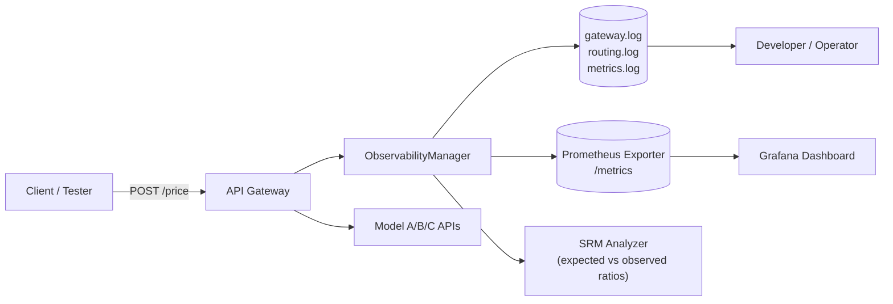
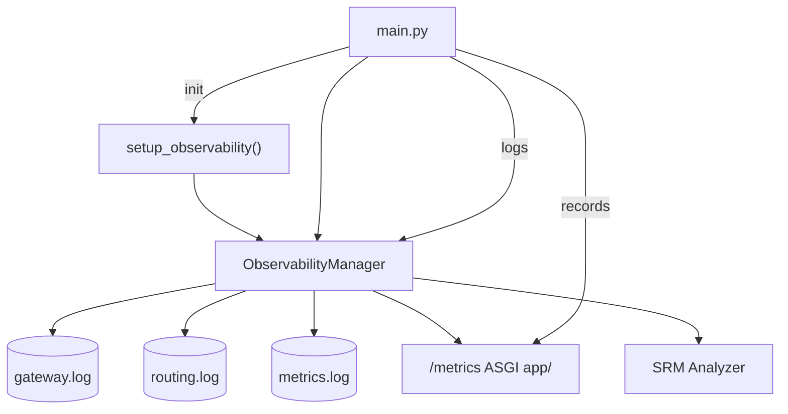

# Observability and Monitoring

This document describes how the Ominimo API Gateway captures metrics, logs, and health information for performance visibility and experiment validation.

---
## Objectives

- Track gateway activity (requests, routing, and downstream calls).
- Monitor A/B testing exposures and detect sample ratio mismatches (SRM).
- Collect Prometheus-compatible metrics for dashboards and alerting.
- Provide structured logs for debugging and audit.

---
## 1. Observability Architecture
The `ObservabilityManager` in `gateway/app/observability.py` is the central component responsible for logging, metrics, and SRM analysis.



---
## 2. Logging Overview
All logs are handled by `gateway/app/observability.py`.

Log files

| File          | Purpose                                        |
|---------------|------------------------------------------------|
| `gateway.log` | Request lifecycle (received, completed, error) |
| `routing.log` | Routing decisions & SRM diagnostics            |
| `metrics.log` | Exposure lines & per-model timing summaries    |

Example entries
```
2025-10-28 12:01:55 - gateway - INFO - Request 1e9c... received from 127.0.0.1: car=VW Golf
2025-10-28 12:01:55 - routing - INFO - Request 1e9c... routed to model-b using rule 'ab_testing_percentage' (postal_code=23000)
2025-10-28 12:01:55 - gateway - INFO - Request 1e9c... completed by model-b: price=1234.56 EUR, time=0.083s
2025-10-28 12:01:55 - metrics - INFO - exposure experiment=api_routing_2025_10 unit=23000 model=model-b
2025-10-28 12:02:55 - routing - INFO - SRM exp=api_routing_2025_10 total=300 counts={'model-a':98,'model-b':104,'model-c':98} chi2=0.05 suspicious=False
```

---
## 3. Prometheus Metrics

Endpoint
```
GET http://localhost:8000/metrics
```

Mounted via:
```python
from prometheus_client import make_asgi_app
app.mount("/metrics", make_asgi_app())
```

Metric Families

| Metric                                 | Labels               | Description                          |
|----------------------------------------|----------------------|--------------------------------------|
| `gateway_model_requests_total`         | `{model}`            | Total requests routed to each model  |
| `gateway_model_errors_total`           | `{model}`            | Count of downstream call errors      |
| `gateway_model_latency_seconds_bucket` | `{model,le}`         | Histogram of model latency           |
| `gateway_exposures_total`              | `{experiment,model}` | Count of A/B assignments (exposures) |

Quick check
```
curl -s http://localhost:8000/metrics | grep 'gateway_'
```

Output example:
```
gateway_model_requests_total{model="model-a"} 120
gateway_model_latency_seconds_sum{model="model-b"} 9.245
gateway_exposures_total{experiment="api_routing_2025_10",model="model-c"} 98
```

---
## 4. Example Grafana / PromQL Queries

| Purpose                 | PromQL Query                                                                                                      |
|-------------------------|-------------------------------------------------------------------------------------------------------------------|
| Requests per model      | `sum by (model) (rate(gateway_model_requests_total[5m]))`                                                         |
| Error rate              | `sum by (model) (rate(gateway_model_errors_total[5m])) / sum by (model) (rate(gateway_model_requests_total[5m]))` |
| 95th percentile latency | `histogram_quantile(0.95, sum by (le,model) (rate(gateway_model_latency_seconds_bucket[5m])))`                    |
| Traffic share (A/B)     | `sum by (model) (gateway_exposures_total)`                                                                        |

---
## 5. SRM (Sample Ratio Mismatch) Checks
Purpose
To verify that A/B traffic is distributed close to configured weights (e.g., 0.33/0.33/0.34).

Implementation

- Runs automatically inside ObservabilityManager._maybe_log_srm().
- Uses a Chi-Square Goodness-of-Fit test.
- Logs results every 60 s once ≥ 50 exposures are recorded.

Example Log Output
```
SRM exp=api_routing_2025_10 total=600
counts={'model-a':200,'model-b':205,'model-c':195}
expected={'model-a':0.33,'model-b':0.33,'model-c':0.34}
chi2=0.07 df=2 suspicious=False
```

If suspicious=True, investigate:

- Configured weights vs. observed traffic
- Missing or disabled models
- Logging or hash collisions on unit_field

---
## 6. Performance Metrics
Middleware in `main.py` adds two headers:

| Header           | Description                             |
|------------------|-----------------------------------------|
| `X-Request-ID`   | Unique identifier for correlation       |
| `X-Process-Time` | Total request processing time (seconds) |

Prometheus latency histograms capture downstream model timings:
```
gateway_model_latency_seconds_bucket{model="model-b",le="0.1"} 120
```
Use this to monitor SLA compliance (e.g., p95 < 200 ms).

---
## 7. How ObservabilityManager Works



Core methods:

- `log_request()` → incoming payloads
- `log_routing_decision()` → chosen model & rule
- `log_exposure()` → increments Prometheus exposure counter + SRM stats
- `log_model_response()` → latency, price, success
- `log_error()` → structured error line
- `prom_record_model_call()` → success/error + latency histogram

---
## 8. Common Observability Commands

| Task                       | Command                                                                    |                                |
|----------------------------|----------------------------------------------------------------------------|--------------------------------|
| Tail logs                  | `docker compose logs -f gateway`                                           |                                |
| Check /metrics manually    | `curl -s localhost:8000/metrics                                            | grep gateway_`                 |
| Watch exposures grow       | `watch -n 2 "curl -s localhost:8000/metrics                                | grep gateway_exposures_total"` |
| Reload config              | `curl -X POST localhost:8000/config/reload`                                |                                |
| Query p95 latency (PromQL) | `histogram_quantile(0.95, rate(gateway_model_latency_seconds_bucket[5m]))` |                                |

---
## 9. Troubleshooting

| Symptom                    | Possible Cause                    | Fix                                                   |
|----------------------------|-----------------------------------|-------------------------------------------------------|
| **/metrics** returns `307` | Redirect from mount               | Use `/metrics/` or `follow_redirects=True`.           |
| **Missing model metrics**  | Model not yet routed to           | Send traffic or enable in YAML.                       |
| **SRM flagged suspicious** | Too few samples or skewed weights | Increase traffic; confirm weights in `models.yaml`.   |
| **High avg latency**       | Slow model container              | Check logs for response times and CPU throttling.     |
| **No logs written**        | `LOG_LEVEL` or `LOG_DIR` unset    | Verify environment variables in `docker-compose.yml`. |

---
# Summary

| Area                   | Data Source          | Location        |
|------------------------|----------------------|-----------------|
| Request lifecycle      | `gateway.log`        | `gateway/logs/` |
| Routing decisions      | `routing.log`        | `gateway/logs/` |
| A/B exposures & timing | `metrics.log`        | `gateway/logs/` |
| Prometheus metrics     | `/metrics`           | FastAPI mount   |
| SRM check              | `routing.log`        | every 60 s      |
| Visualization          | Prometheus / Grafana | dashboards      |
