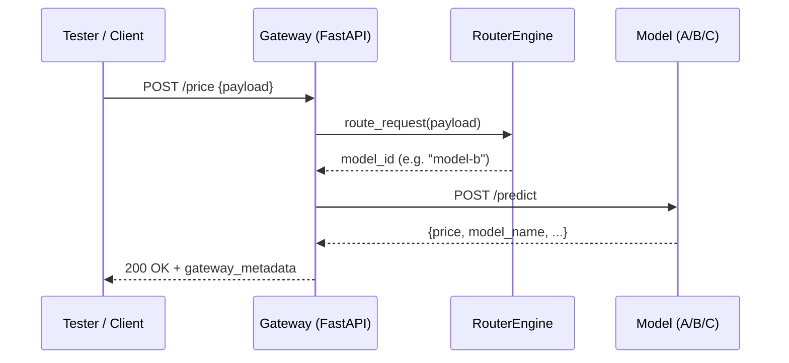

# Testing Routing and A/B Logic

This guide explains how to verify routing rules, A/B testing distribution, and end-to-end behavior of the Ominimo API Gateway using both automated and manual tools.

---
## Objectives

- Validate feature-based routing (birthdate, postal code).
- Confirm sticky A/B testing logic.
- Check metrics and SRM (sample ratio mismatch) consistency.
- Run the automated pytest suite and demo scripts for full coverage.

## 1. Test Environment Overview
Endpoints used:

|       Endpoint        | Purpose                                   |
|:---------------------:|:------------------------------------------|
|     `POST /price`     | Main entry point for routing tests        |
|     `GET /health`     | Service availability and per-model status |
|     `GET /config`     | Verify routing rule and A/B settings      |
| `POST /config/reload` | Reload YAML configuration after changes   |
|   `GET /metrics`      | Prometheus metrics and exposure counters  |

---
## 2. Routing Rules to Validate

Gateway supports three routing strategies (see gateway/app/routing.py):

| Rule                       | Description                                  | Example                            |
|----------------------------|----------------------------------------------|------------------------------------|
| **birthdate_even_odd**     | Even birthdate → model-a, odd → model-b      | `1995-06-14` → A, `1995-06-15` → B |
| **postal_code_region**     | First digit of postal code determines region | 1-3 → A, 4-6 → B, 7-9 → C          |
| **ab_testing_percentage**  | Sticky A/B distribution via hashing          | Random postal codes → ~33% A/B/C   |

Confirm the current active rule:

```shell
curl -s http://localhost:8000/config | jq '.routing_rules.default'
```

---
## 3. Automated Test Suite (Pytest)

Run all core tests
```shell
poetry run pytest -q tests/test_gateway.py tests/test_sample_payloads.py
```

Key tests

| Test                                                | Description                                                |
|-----------------------------------------------------|------------------------------------------------------------|
| `test_health_ok`                                    | Gateway and models reachable                               |
| `test_all_sample_payloads_status_codes`             | Valid → 200, invalid → 422                                 |
| `test_birthdate_even_odd_rule_if_enabled`           | Checks correct model mapping when rule is active           |
| `test_ab_distribution_if_enabled`                   | Randomized A/B test, validates distribution and stickiness |
| `test_metrics_endpoint_exposes_prometheus_counters` | Verifies `/metrics` endpoint availability                  |


### Distribution check output
```
model-a  count=185  share=33.2%
model-b  count=203  share=36.4%
model-c  count=169  share=30.4%
```

---
## 4. Sample Payload Tests

All payloads are in `tests/sample_payloads.json`:

```
{
  "even_birthdate_model_a": { "birthdate": "1995-06-14", ... },
  "odd_birthdate_model_b": { "birthdate": "1995-06-15", ... },
  "postal_region_a_north": { "postal_code": "1999ZZ", ... },
  "ab_unit_variation_1": { "postal_code": "10001", ... },
  ...
}
```

Run with:

```shell
poetry run pytest -q tests/test_sample_payloads.py
```

---
## 5. Demo Test Runner (Non-strict Mode)

For presentation or development runs, use:

```
python tests/test_gateway.py
```

- Produces colored console output (✓ PASS, ⚠ WARN).
- Handles both “expected fails” (invalid inputs → 422) and slow models gracefully.

---
## 6. Metrics and Observability

Prometheus Metrics

Access at:
`http://localhost:8000/metrics`

Key families:

| Metric                                          | Description                    |
|-------------------------------------------------|--------------------------------|
| `gateway_model_requests_total{model=…}`         | Number of requests per model   |
| `gateway_model_errors_total{model=…}`           | Error counts per model         |
| `gateway_model_latency_seconds_bucket{model=…}` | Histogram of latency per model |
| `gateway_exposures_total{experiment,model}`     | A/B exposure counts            |

Check live data:

`curl -s http://localhost:8000/metrics | grep 'gateway_'`

---
## SRM (Sample Ratio Mismatch) Validation

ObservabilityManager automatically performs a test comparing observed vs. expected A/B proportions.

Logged in `gateway/logs/routing.log`:

```
2025-10-29 04:06:38,938 - routing - INFO - SRM exp=api_routing_2025_10 total=300
counts={'model-a': 98, 'model-b': 104, 'model-c': 98}
expected={'model-a': 0.33, 'model-b': 0.33, 'model-c': 0.34}
chi2=0.05 df=2 suspicious=False
```

- suspicious=True Normal distribution
- suspicious=True → indicates bias or logging issues.

---
## 8. Routing Flow Diagram



---
## 9. Manual Routing Checks

### 9.1 Birthdate rule

```
curl -s -X POST localhost:8000/price -H "Content-Type: application/json" \
-d '{"birthdate":"1995-06-14","driver_license_date":"2015-08-20","car_model":"Golf","car_brand":"Volkswagen","postal_code":"1234AC"}' | jq '.gateway_metadata.model_id'
# Expect: model-a
```

### 9.2 Postal-region rule
```
curl -s -X POST localhost:8000/price -H "Content-Type: application/json" \
-d '{"birthdate":"1990-06-12","driver_license_date":"2010-07-01","car_model":"Civic","car_brand":"Honda","postal_code":"7890XX"}' | jq '.gateway_metadata.model_id'
# Expect: model-c
```

### 9.3 A/B Testing
```
for i in {1..100}; do
  pc=$((10000 + RANDOM % 90000))
  curl -s -X POST localhost:8000/price \
    -H "Content-Type: application/json" \
    -d "{\"birthdate\":\"1990-06-12\",\"driver_license_date\":\"2010-07-01\",\"car_model\":\"Golf\",\"car_brand\":\"VW\",\"postal_code\":\"$pc\"}" \
  | jq -r '.gateway_metadata.model_id'
done | sort | uniq -c
```

---
## 10. Performance and Timing

Middleware adds:

- X-Request-ID
- X-Process-Time headers.

Inspect:
```
curl -v -X POST http://localhost:8000/price ... | grep "X-Process-Time"
```

Typical processing times (local Docker):

- Gateway: ~80–150 ms
- Model service: ~20–80 ms

Performance thresholds tested in demo_suite.py:
```
MAX_AVG=2.0 MAX_P95=5.0 python tests/demo_suite.py
```

---
## 11. Troubleshooting Common Issues

| Symptom                  | Cause / Fix                                             |
|--------------------------|---------------------------------------------------------|
| `/metrics` returns 307   | Use `/metrics/` or allow redirects.                     |
| All traffic → one model  | Verify `unit_field` and `experiment_id` consistency.    |
| SRM flagged “suspicious” | Too few samples (< 50) or skewed weights.               |
| `/price` returns 502     | Check model container health and URLs in `models.yaml`. |

---
# Summary
| Validation                | Method                                    |
|---------------------------|-------------------------------------------|
| **Feature-based routing** | Birthdate & postal tests                  |
| **Sticky A/B testing**    | Random postal codes, observe distribution |
| **Metrics exposure**      | `/metrics` counters                       |
| **Observability**         | Logs: gateway, routing, metrics           |
| **Performance**           | Headers and test_gateway timing tests     |

